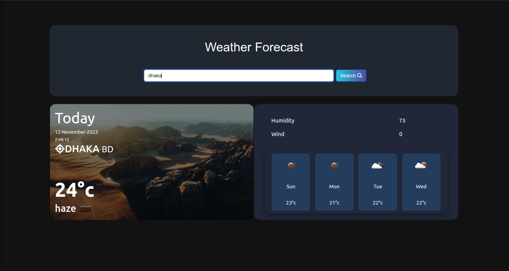

# weather-app

vue application develop using composition api and openweather api

## Project Setup

```sh
npm install
```

### Compile and Hot-Reload for Development

```sh
npm run dev
```

### Compile and Minify for Production

```sh
npm run build
```

### Access the site using this url locally

http://localhost:5173/
## Environment Variables

To run this project, you will need to add the following environment variables to your .env.sample file and remove .sample from the filename

`VITE_OPENWEATHER_API_KEY`


## Screenshots



